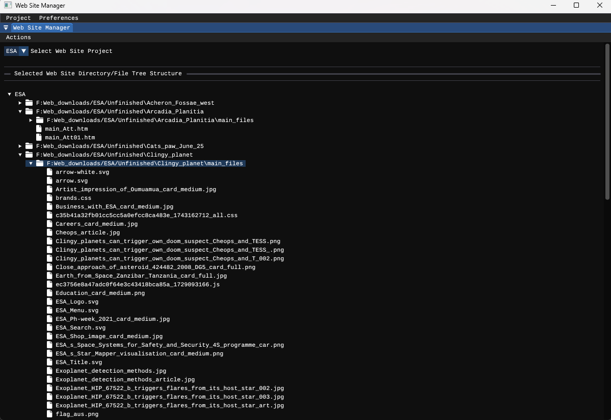

## Web Site Manager (WSM)

## Introduction

Web Site Manager (WSM) is an application that is designed specifically to manage the files that are stored in a web site project directory.
A web site directory structure will have webpage related files such as image, video, sound, html page and .css files in a structured form of specific directories.
Web site manager not only manages the simple tasks of any file manager software such as move, delete and copying of files, but it also performs the tasks of 
tracking and updating the html links and source dependencies that exist with the html web page files of the project.

The Web Site Manager application is not a conventional file manager with two or more lists of directory contents in a panel, but is a file manager that displays
the file structure of a web project as a tree. (Fig 01) 

     

 
 
Fig 01

Inspiration for doing this came from Dreamwaever which has these capabilities, but since Adobe asks too high a price for monthly subscriptions for a part time user
of such software, I decided to try and emulate as best I could this feature that could not be found in any other application. It only took me a few hours to figure
out the basics of how to do this from scratch, and I was agast why no other software that edits and manages html web pages and files has not this feature.

This is considered as being complete in the goals set out to achieve and has been successfull for personal use purposes. However there may still be some undiscovered
problems and bugs that will be resolved in any future updates.

The application uses ImGui and is coded in ISO C++20 Standard as a visual studio community project.

## Installation:

This project is a Visual Studio 2022/2026 using SDK 10 ISO C++ 20 Standard project set up for windows. 

1 : Download the files within the ws_manager repository to a desired directory location.

2 : Open visual studio and open the visual studio project ws_manager.sln file.

3 : Compile and run the code.

4 : the resultant compiled code and dependent files that the application needs to run is in the Bin/x64/Release and Bin/x64/Debug directories.

or

Copy all of the contents in the directory Executable/WSM to a desired location and open the Executable ws_manager.exe. 
This is a Windows only application compiled in Visual studio 26 and tested on a Windows 11 system.

It seems github got something wrong as no WSM subdirectory was uploaded and it named the directory Executable to Executable/WSM.
Looks like a github directory copy naming bug here that was initiated from Visual Studio 26.

## How to use

A user guide provided in pdf format is available in the documentation directory that gives a detailed descritption and explaination on how to use this application.

## Dependencies
    These are a list of the current third party dependacies for this project

    glfw
    glew
    ImGui
    imgui-docking
	tinyFileDialog

Only one Dependency libs to be defined as glfw is compiled from code and no glfw lib referenced for this project.

    opengl32.lib

## Source Code

Because this is a working project, within the source code is a lot of debugging code that has largely been commented out.

Much of the code has been written for as easy reading as much as possible to understand what the code does and is for. However some of the code that has been adopted or copied from 3rd parties may follow a different naming convention.

A pdf file WSM_source_notes_draft00 is provided that gives a detailed description of the core design and coding of this application. 

